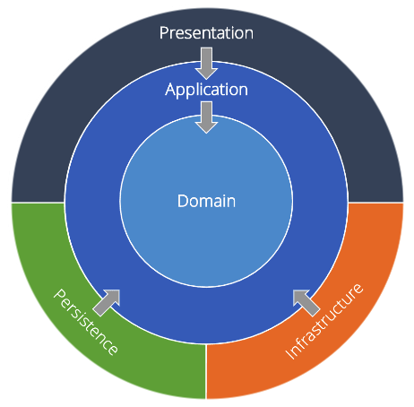

# OnionTx 
[](https://github.com/kozmod/oniontx/actions/workflows/test.yml)
[](https://github.com/kozmod/oniontx/actions/workflows/release.yml)

[](https://goreportcard.com/report/github.com/kozmod/oniontx)


[](https://github.com/kozmod/oniontx/blob/dev/LICENSE)

The utility for transferring transaction management of the stdlib to the service layer.

**NOTE**: Transactor was developed to work with only the same instance of tha `*sql.DB`
___
## Main idea
# 
Move a maintaining of transactions to `Application` layer using owner defined contract. 
Library contains contracts and abstractions to adapt any other library to move transactions to `Application` layer.
___

## Examples

---
1️⃣ Execution a transaction for different `repositories` with the same `oniontx.Transactor` instance:
```go
package db

import (
	"context"
	"database/sql"

	"github.com/kozmod/oniontx"
)

// Executor represents common methods of sql.DB and sql.Tx.
type Executor interface {
	ExecContext(ctx context.Context, query string, args ...any) (sql.Result, error)
}

// DB is sql.DB wrapper, implements oniontx.TxBeginner.
type DB struct {
	*sql.DB
}

func (db *DB) BeginTx(ctx context.Context, opts ...oniontx.Option[*sql.TxOptions]) (*Tx, error) {
	var txOptions sql.TxOptions
	for _, opt := range opts {
		opt.Apply(&txOptions)
	}
	tx, err := db.DB.BeginTx(ctx, &txOptions)
	return &Tx{Tx: tx}, err
}

// Tx is sql.Tx wrapper, implements oniontx.TxCommitter.
type Tx struct {
	*sql.Tx
}

func (t *Tx) Rollback(_ context.Context) error {
	return t.Tx.Rollback()
}

func (t *Tx) Commit(_ context.Context) error {
	return t.Tx.Commit()
}
```
```go
package repoA

import (
	"context"
	"fmt"

	"github.com/kozmod/oniontx"

	"github.com/user/some_project/internal/db"
)

type RepositoryA struct {
	Transactor *oniontx.Transactor[*db.DB, *db.Tx, *sql.TxOptions]
}

func (r RepositoryA) Insert(ctx context.Context, val int) error {
	var executor db.Executor
	executor, ok  := r.Transactor.TryGetTx(ctx)
	if !ok {
		executor = r.Transactor.TxBeginner()
	}
	_, err := executor.ExecContext(ctx, "UPDATE some_A SET value = $1", val)
	if err != nil {
		return fmt.Errorf("update 'some_A': %w", err)
	}
	return nil
}
```
```go
package repoB

import (
	"context"
	"fmt"
	
	"github.com/kozmod/oniontx"
	
	"github.com/user/some_project/internal/db"
)

type RepositoryB struct {
	Transactor *oniontx.Transactor[*db.DB, *db.Tx, *sql.TxOptions]
}

func (r RepositoryB) Insert(ctx context.Context, val int) error {
	var executor db.Executor
	executor, ok := r.Transactor.TryGetTx(ctx)
	if !ok {
		executor = r.Transactor.TxBeginner()
	}
	_, err := executor.ExecContext(ctx, "UPDATE some_A SET value = $1", val)
	if err != nil {
		return fmt.Errorf("update 'some_A': %w", err)
	}
	return nil
}
```
```go
package usecase

import (
	"context"
	"fmt"
)

type (
	// transactor is the contract of  the oniontx.Transactor
	transactor interface {
		WithinTx(ctx context.Context, fn func(ctx context.Context) error) (err error)
	}

	// Repo is the contract of repositories
	repo interface {
		Insert(ctx context.Context, val int) error
	}
)

type UseCase struct {
	RepoA repo
	RepoB repo

	Transactor transactor
}

func (s *UseCase) Exec(ctx context.Context, insert int) error {
	err := s.Transactor.WithinTx(ctx, func(ctx context.Context) error {
		if err := s.RepoA.Insert(ctx, insert); err != nil {
			return fmt.Errorf("call repository A: %w", err)
		}
		if err := s.RepoB.Insert(ctx, insert); err != nil {
			return fmt.Errorf("call repository B: %w", err)
		}
		return nil
	})
	if err != nil {
		return fmt.Errorf(" execute: %w", err)
	}
	return nil
}
```
```go
package main

import (
	"context"
	"database/sql"
	"os"
	
	"github.com/kozmod/oniontx"
	
	"github.com/user/some_project/internal/repoA"
	"github.com/user/some_project/internal/repoB"
	"github.com/user/some_project/internal/usecase"
)


func main() {
	var (
		database *sql.DB // database pointer

		wrapper    = &db.DB{DB: database}
		operator   = oniontx.NewContextOperator[*db.DB, *db.Tx, *sql.TxOptions](&wrapper)
		transactor = oniontx.NewTransactor[*db.DB, *db.Tx, *sql.TxOptions](wrapper, operator)

		repositoryA = repoA.RepositoryA{
			Transactor: transactor,
		}
		repositoryB = repoB.RepositoryB{
			Transactor: transactor,
		}

		useCase = usecase.UseCase{
			RepoA: &repositoryA,
			RepoB: &repositoryB,
			Transactor:  transactor,
		}
	)

	err := useCase.Exec(context.Background(), 1)
	if err != nil {
		os.Exit(1)
	}
}
```
---
2️⃣ Execution a transaction with `sql.TxOptions`:
```go
package db

// ... other contracts and abstraction implementations


// TxOption implements oniontx.Option.
type TxOption func(opt *sql.TxOptions)

// Apply the TxOption to sql.TxOptions.
func (r TxOption) Apply(opt *sql.TxOptions) {
	r(opt)
}

// WithReadOnly set `ReadOnly` sql.TxOptions option.
func WithReadOnly(readonly bool) oniontx.Option[*sql.TxOptions] {
	return TxOption(func(opt *sql.TxOptions) {
		opt.ReadOnly = readonly
	})
}

// WithIsolationLevel set sql.TxOptions isolation level.
func WithIsolationLevel(level int) oniontx.Option[*sql.TxOptions] {
	return TxOption(func(opt *sql.TxOptions) {
		opt.Isolation = sql.IsolationLevel(level)
	})
}

```
```go
func (s *Usecase) Do(ctx context.Context) error {
	err := s.Transactor.WithinTxWithOpts(ctx, func(ctx context.Context) error {
		if err := s.RepositoryA.Do(ctx); err != nil {
			return fmt.Errorf("call repositoryA: %+v", err)
		}
		if err := s.RepositoryB.Do(ctx); err != nil {
			return fmt.Errorf("call repositoryB: %+v", err)
		}
		return nil
	},
		db.WithReadOnly(true),
		db.WithIsolationLevel(6))
	if err != nil {
		return fmt.Errorf("execute: %v", err)
	}
	return nil
}
```
---
3️⃣Execution the same transaction for different `usecases` with the same `oniontx.Transactor` instance:
```go
package a

import (
	"context"
	"fmt"
)

type (
	// transactor is the contract of  the oniontx.Transactor
	transactor interface {
		WithinTx(ctx context.Context, fn func(ctx context.Context) error) (err error)
	}

	// Repo is the contract of repositories
	repoA interface {
		Insert(ctx context.Context, val int) error
		Delete(ctx context.Context, val float64) error
	}
)

type UseCaseA struct {
	Repo repoA

	Transactor transactor
}

func (s *UseCaseA) Exec(ctx context.Context, insert int, delete float64) error {
	err := s.Transactor.WithinTx(ctx, func(ctx context.Context) error {
		if err := s.Repo.Insert(ctx, insert); err != nil {
			return fmt.Errorf("call repository - insert: %w", err)
		}
		if err := s.Repo.Delete(ctx, delete); err != nil {
			return fmt.Errorf("call repository - delete: %w", err)
		}
		return nil
	})
	if err != nil {
		return fmt.Errorf("usecaseA - execute: %w", err)
	}
	return nil
}
```
```go
package b

import (
	"context"
	"fmt"
)

type (
	// transactor is the contract of  the oniontx.Transactor
	transactor interface {
		WithinTx(ctx context.Context, fn func(ctx context.Context) error) (err error)
	}

	// Repo is the contract of repositories
	repoB interface {
		Insert(ctx context.Context, val string) error
	}

	// Repo is the contract of the useCase
	useCaseA interface {
		Exec(ctx context.Context, insert int, delete float64) error
	}
)

type UseCaseB struct {
	Repo     repoB
	UseCaseA useCaseA

	Transactor transactor
}

func (s *UseCaseB) Exec(ctx context.Context, insertA string, insertB int, delete float64) error {
	err := s.Transactor.WithinTx(ctx, func(ctx context.Context) error {
		if err := s.Repo.Insert(ctx, insertA); err != nil {
			return fmt.Errorf("call repository - insert: %w", err)
		}
		if err := s.UseCaseA.Exec(ctx, insertB, delete); err != nil {
			return fmt.Errorf("call usecaseB - exec: %w", err)
		}
		return nil
	})
	if err != nil {
		return fmt.Errorf("execute: %w", err)
	}
	return nil
}
```
```go
package main

import (
	"context"
	"database/sql"
	"os"

	"github.com/kozmod/oniontx"

	"github.com/user/some_project/internal/db"
	"github.com/user/some_project/internal/repoA"
	"github.com/user/some_project/internal/repoB"
	"github.com/user/some_project/internal/usecase/a"
	"github.com/user/some_project/internal/usecase/b"
)

func main() {
	var (
		database *sql.DB // database pointer

		wrapper    = &db.DB{DB: database}
		operator   = oniontx.NewContextOperator[*db.DB, *db.Tx, *sql.TxOptions](&wrapper)
		transactor = oniontx.NewTransactor[*db.DB, *db.Tx, *sql.TxOptions](wrapper, operator)

		useCaseA = a.UseCaseA{
			Repo: repoA.RepositoryA{
				Transactor: transactor,
			},
		}

		useCaseB = b.UseCaseB{
			Repo: repoB.RepositoryB{
				Transactor: transactor,
			},
			UseCaseA: &useCaseA,
		}
	)

	err := useCaseB.Exec(context.Background(), "some_to_insert_useCase_A", 1, 1.1)
	if err != nil {
		os.Exit(1)
	}
}
```