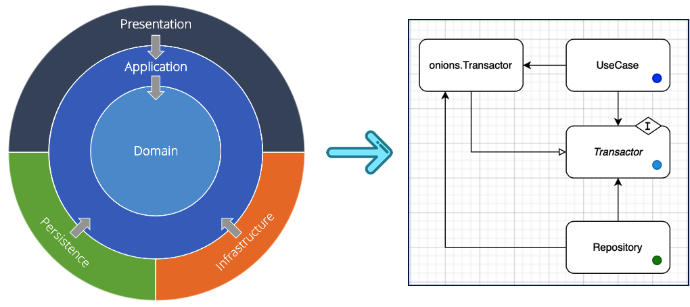
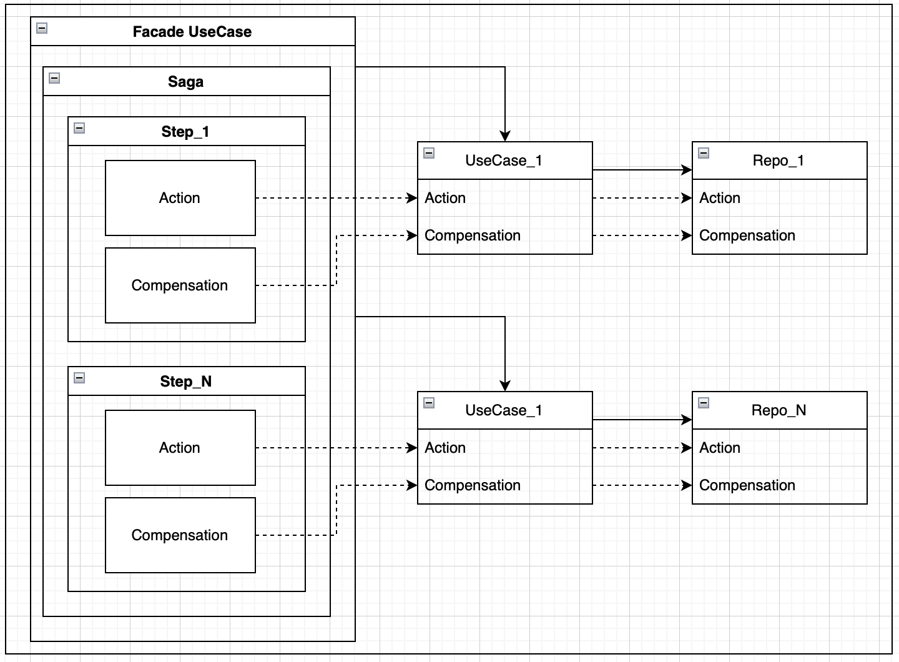

# oniontx 
[](https://github.com/kozmod/oniontx/actions/workflows/test.yml)
[](https://github.com/kozmod/oniontx/actions/workflows/release.yml)

[](https://goreportcard.com/report/github.com/kozmod/oniontx)


[](https://github.com/kozmod/oniontx/blob/dev/LICENSE)

`oniontx` enables moving transaction management from the `Persistence` (repository) layer 
to the `Application` (service) layer using an owner-defined contract.

The library provides **two complementary approaches** that can be used independently or together:
- **`mtx` package**: Local ACID transactions for single-resource operations
- **`saga` package**: Distributed compensating transactions for multi-resource coordination

Both packages maintain clean architecture principles by keeping transaction control at the application 
level while repositories remain focused on data access.

### 🌟 Key Features
- **Clean Architecture First**: Transactions managed at the application layer, not in repositories
- **Dual Transaction Support**:
    - `mtx` package for local ACID transactions (single database)
    - `saga` package for distributed compensating transactions (multiple services/databases)
- **Database Agnostic**: Ready-to-use implementations for popular databases and libraries
- **Testability First**: Built-in support for major testing frameworks
- **Type-Safe**: Full generics support for compile-time safety
- **Context-Aware**: Proper context propagation throughout transaction boundaries

### Package mtx - Local Transactions

# 
🔴 **NOTE:** Use `mtx` when working with a **single** database instance. 
It manages ACID transactions across multiple repositories.
For multiple repositories, use `mtx.Transactor` with `saga.Saga`[<sup>**ⓘ**</sup>](#saga).

The core entity is **`Transactor`** — it provides a clean abstraction over database transactions and offers:
 - [**simple implementation for `stdlib`**](#libs)
 - [**simple implementation for popular libraries**](#libs)
 - [**custom implementation's contract**](#custom)
 - [**simple testing with testing frameworks**](#testing)

---
### <a name="libs"><a/>Default implementation examples for libs
[test/integration](https://github.com/kozmod/oniontx/tree/master/test) module contains  examples 
of default `Transactor` implementations (stdlib, sqlx, pgx, gorm, redis, mongo):
- [stdlib](https://github.com/kozmod/oniontx/tree/master/test/integration/internal/stdlib)
- [sqlx](https://github.com/kozmod/oniontx/tree/master/test/integration/internal/sqlx)
- [pgx](https://github.com/kozmod/oniontx/tree/master/test/integration/internal/pgx)
- [gorm](https://github.com/kozmod/oniontx/tree/master/test/integration/internal/gorm)
- [redis](https://github.com/kozmod/oniontx/tree/master/test/integration/internal/redis)
- [mongo](https://github.com/kozmod/oniontx/tree/master/test/integration/internal/mongo)

---

####  <a name="custom"><a/>Custom implementation
If required, `oniontx` provides the ability to 
implement custom algorithms for managing transactions (see examples).
#### Interfaces:
```go 
type (
	// Mandatory
	TxBeginner[T Tx] interface {
		comparable
		BeginTx(ctx context.Context) (T, error)
	}
	
	// Mandatory
	Tx interface {
		Rollback(ctx context.Context) error
		Commit(ctx context.Context) error
	}

	// Optional - using to putting/getting transaction from `context.Context` 
	// (library contains default `СtxOperator` implementation)
	СtxOperator[T Tx] interface {
		Inject(ctx context.Context, tx T) context.Context
		Extract(ctx context.Context) (T, bool)
	}
)
```
### Examples 
`❗` ️***These examples are based on the `stdlib` package.***

`TxBeginner` and `Tx` implementations:
```go
// Prepared contracts for execution
package db

import (
	"context"
	"database/sql"

	"github.com/kozmod/oniontx/mtx"
)

// Executor represents common methods of sql.DB and sql.Tx.
type Executor interface {
	ExecContext(ctx context.Context, query string, args ...any) (sql.Result, error)
}

// DB is sql.DB wrapper, implements mtx.TxBeginner.
type DB struct {
	*sql.DB
}

func (db *DB) BeginTx(ctx context.Context) (*Tx, error) {
	var txOptions sql.TxOptions
	for _, opt := range opts {
		opt.Apply(&txOptions)
	}
	tx, err := db.DB.BeginTx(ctx, &txOptions)
	return &Tx{Tx: tx}, err
}

// Tx is sql.Tx wrapper, implements mtx.Tx.
type Tx struct {
	*sql.Tx
}

func (t *Tx) Rollback(_ context.Context) error {
	return t.Tx.Rollback()
}

func (t *Tx) Commit(_ context.Context) error {
	return t.Tx.Commit()
}
```
`Repositories` implementation:
```go
package repoA

import (
	"context"
	"fmt"

	"github.com/kozmod/oniontx/mtx"

	"github.com/user/some_project/internal/db"
)

type RepositoryA struct {
	Transactor *mtx.Transactor[*db.DB, *db.Tx]
}

func (r RepositoryA) Insert(ctx context.Context, val int) error {
	var executor db.Executor
	executor, ok  := r.Transactor.TryGetTx(ctx)
	if !ok {
		executor = r.Transactor.TxBeginner()
	}
	_, err := executor.ExecContext(ctx, "UPDATE some_A SET value = $1", val)
	if err != nil {
		return fmt.Errorf("update 'some_A': %w", err)
	}
	return nil
}
```
```go
package repoB

import (
	"context"
	"fmt"
	
	"github.com/kozmod/oniontx/mtx"
	
	"github.com/user/some_project/internal/db"
)

type RepositoryB struct {
	Transactor *mtx.Transactor[*db.DB, *db.Tx]
}

func (r RepositoryB) Insert(ctx context.Context, val int) error {
	var executor db.Executor
	executor, ok := r.Transactor.TryGetTx(ctx)
	if !ok {
		executor = r.Transactor.TxBeginner()
	}
	_, err := executor.ExecContext(ctx, "UPDATE some_A SET value = $1", val)
	if err != nil {
		return fmt.Errorf("update 'some_A': %w", err)
	}
	return nil
}
```
`UseCase` implementation:
```go
package usecase

import (
	"context"
	"fmt"
)

type (
	// transactor is the contract of  the mtx.Transactor
	transactor interface {
		WithinTx(ctx context.Context, fn func(ctx context.Context) error) (err error)
	}

	// Repo is the contract of repositories
	repo interface {
		Insert(ctx context.Context, val int) error
	}
)

type UseCase struct {
	RepoA repo
	RepoB repo

	Transactor transactor
}

func (s *UseCase) Exec(ctx context.Context, insert int) error {
	err := s.Transactor.WithinTx(ctx, func(ctx context.Context) error {
		if err := s.RepoA.Insert(ctx, insert); err != nil {
			return fmt.Errorf("call repository A: %w", err)
		}
		if err := s.RepoB.Insert(ctx, insert); err != nil {
			return fmt.Errorf("call repository B: %w", err)
		}
		return nil
	})
	if err != nil {
		return fmt.Errorf(" execute: %w", err)
	}
	return nil
}
```
Configuring:
```go
package main

import (
	"context"
	"database/sql"
	"os"

	"github.com/kozmod/oniontx/mtx"
	
	"github.com/user/some_project/internal/repoA"
	"github.com/user/some_project/internal/repoB"
	"github.com/user/some_project/internal/usecase"
)


func main() {
	var (
		database *sql.DB // database pointer

		wrapper    = &db.DB{DB: database}
		operator   = mtx.NewContextOperator[*db.DB, *db.Tx](&wrapper)
		transactor = mtx.NewTransactor[*db.DB, *db.Tx](wrapper, operator)

		repositoryA = repoA.RepositoryA{
			Transactor: transactor,
		}
		repositoryB = repoB.RepositoryB{
			Transactor: transactor,
		}

		useCase = usecase.UseCase{
			RepoA: &repositoryA,
			RepoB: &repositoryB,
			Transactor:  transactor,
		}
	)

	err := useCase.Exec(context.Background(), 1)
	if err != nil {
		os.Exit(1)
	}
}
```
---
#### Execution transaction in the different use cases
***Executing the same transaction for different `UseCases` using the same `Transactor` instance***

UseCases:
```go
package a

import (
	"context"
	"fmt"
)

type (
	// transactor is the contract of  the mtx.Transactor
	transactor interface {
		WithinTx(ctx context.Context, fn func(ctx context.Context) error) (err error)
	}

	// Repo is the contract of repositories
	repoA interface {
		Insert(ctx context.Context, val int) error
		Delete(ctx context.Context, val float64) error
	}
)

type UseCaseA struct {
	Repo repoA

	Transactor transactor
}

func (s *UseCaseA) Exec(ctx context.Context, insert int, delete float64) error {
	err := s.Transactor.WithinTx(ctx, func(ctx context.Context) error {
		if err := s.Repo.Insert(ctx, insert); err != nil {
			return fmt.Errorf("call repository - insert: %w", err)
		}
		if err := s.Repo.Delete(ctx, delete); err != nil {
			return fmt.Errorf("call repository - delete: %w", err)
		}
		return nil
	})
	if err != nil {
		return fmt.Errorf("usecaseA - execute: %w", err)
	}
	return nil
}
```
```go
package b

import (
	"context"
	"fmt"
)

type (
	// transactor is the contract of  the mtx.Transactor
	transactor interface {
		WithinTx(ctx context.Context, fn func(ctx context.Context) error) (err error)
	}

	// Repo is the contract of repositories
	repoB interface {
		Insert(ctx context.Context, val string) error
	}

	// Repo is the contract of the useCase
	useCaseA interface {
		Exec(ctx context.Context, insert int, delete float64) error
	}
)

type UseCaseB struct {
	Repo     repoB
	UseCaseA useCaseA

	Transactor transactor
}

func (s *UseCaseB) Exec(ctx context.Context, insertA string, insertB int, delete float64) error {
	err := s.Transactor.WithinTx(ctx, func(ctx context.Context) error {
		if err := s.Repo.Insert(ctx, insertA); err != nil {
			return fmt.Errorf("call repository - insert: %w", err)
		}
		if err := s.UseCaseA.Exec(ctx, insertB, delete); err != nil {
			return fmt.Errorf("call usecaseB - exec: %w", err)
		}
		return nil
	})
	if err != nil {
		return fmt.Errorf("execute: %w", err)
	}
	return nil
}
```
Main:
```go
package main

import (
	"context"
	"database/sql"
	"os"

	"github.com/kozmod/oniontx/mtx"

	"github.com/user/some_project/internal/db"
	"github.com/user/some_project/internal/repoA"
	"github.com/user/some_project/internal/repoB"
	"github.com/user/some_project/internal/usecase/a"
	"github.com/user/some_project/internal/usecase/b"
)

func main() {
	var (
		database *sql.DB // database pointer

		wrapper    = &db.DB{DB: database}
		operator   = mtx.NewContextOperator[*db.DB, *db.Tx](&wrapper)
		transactor = mtx.NewTransactor[*db.DB, *db.Tx](wrapper, operator)

		useCaseA = a.UseCaseA{
			Repo: repoA.RepositoryA{
				Transactor: transactor,
			},
		}

		useCaseB = b.UseCaseB{
			Repo: repoB.RepositoryB{
				Transactor: transactor,
			},
			UseCaseA: &useCaseA,
		}
	)

	err := useCaseB.Exec(context.Background(), "some_to_insert_useCase_A", 1, 1.1)
	if err != nil {
		os.Exit(1)
	}
}
```

### <a name="saga"><a/>Package `saga` - Distributed Transactions
Use `saga` when coordinating operations across **multiple** services, databases, 
or external systems. It implements the `Saga` pattern with compensating actions
to maintain data consistency in distributed environments.

The `Saga` coordinates the execution of a business process consisting of multiple steps.
Each step contains:
- **Action**: The main operation to execute
- **Compensation**: A rollback operation that undoes the action if later steps fail


Steps execute sequentially. If any step fails, all previous steps are automatically
compensated in reverse order, ensuring system consistency
# 

Example:
```go
steps := []Step{
	{
		Name: "first step",
		// Action — a function to execute
		Action: func(ctx context.Context) error {
			// Action logic.
			return nil
		},
		// Compensation — a function to compensate an action when an error occurs.
		//
		// Parameters:
		//   - ctx: context for cancellation and deadlines (context that is passed through the action)
		//   - aroseErr: error from the previous action that needs compensation
		Compensation: func(ctx context.Context, aroseErr error) error {
			// Action compensation logic.
			return nil
		},
		// CompensationOnFail needs to add the current compensation to the list of compensations.
		CompensationOnFail: true,
	},
}
// Saga execution.
err := NewSaga(steps).Execute(context.Background())
if err != nil {
	// Error handling.
}
```

More examples:
- [tests](https://github.com/kozmod/oniontx/tree/master/saga/saga_test.go)
- [integration tests](https://github.com/kozmod/oniontx/tree/master/test/integration/internal/saga)


## <a name="testing"><a/>Testing

[test](https://github.com/kozmod/oniontx/tree/master/test) package contains useful examples for creating unit test:

- [vektra/mockery **+** stretchr/testify](https://github.com/kozmod/oniontx/tree/main/test/integration/internal/mock/mockery)
- [go.uber.org/mock/gomock **+** stretchr/testify](https://github.com/kozmod/oniontx/tree/main/test/integration/internal/mock/gomock)
- [gojuno/minimock **+** stretchr/testify](https://github.com/kozmod/oniontx/tree/main/test/integration/internal/mock/minimock)