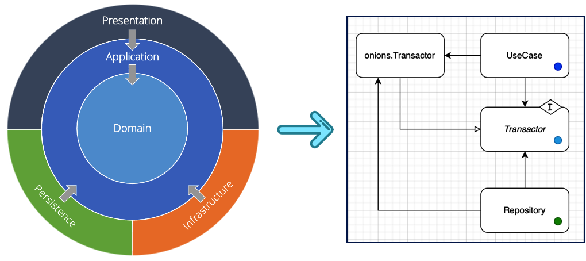
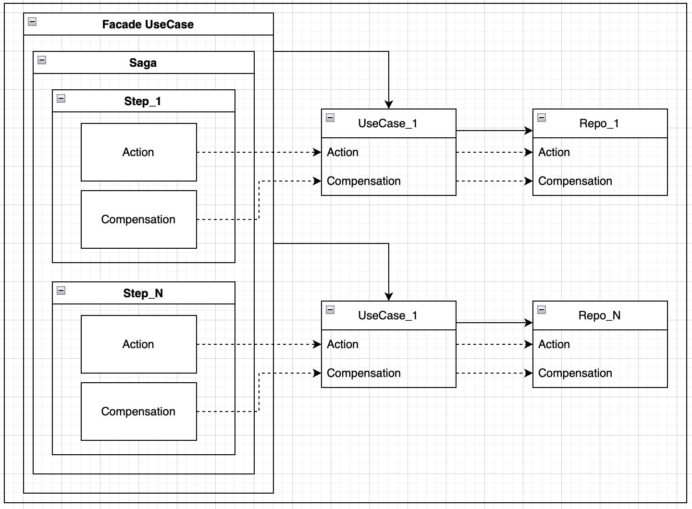

# oniontx 
[](https://github.com/kozmod/oniontx/actions/workflows/test.yml)
[](https://github.com/kozmod/oniontx/actions/workflows/release.yml)

[](https://goreportcard.com/report/github.com/kozmod/oniontx)


[](https://github.com/kozmod/oniontx/blob/dev/LICENSE)

`oniontx` enables moving persistence logic control (for example: transaction management) from the `Persistence` (repository) layer 
to the `Application` (service) layer using an owner-defined contract.

The library provides **two complementary approaches** that can be used independently or together:
- **`mtx` package**: Local ACID transactions for single-resource operations
- **`saga` package**: Local compensating workflows for multi-resource coordination

Both packages maintain clean architecture principles by keeping transaction control at the application 
level while repositories remain focused on data access.

### 💡 Key Features
- **Clean Architecture First**: Transactions managed at the application layer, not in repositories
- **Dual Transaction Support**:
    - `mtx` package for local ACID transactions (single database)
    - `saga` package for in-process compensating workflows (multiple services/databases)
- **Database Agnostic**: Ready-to-use implementations for popular databases and libraries
- **Testability First**: Built-in support for major testing frameworks
- **Type-Safe**: Full generics support for compile-time safety
- **Context-Aware**: Proper context propagation throughout transaction boundaries

### Package `mtx`: Local Transactions

# 
🔴 **NOTE:** Use `mtx` when working with a **single** database instance. 
It manages ACID transactions across multiple repositories.
For multiple repositories, use `mtx.Transactor` with `saga.Saga`[<sup>**ⓘ**</sup>](#saga).

The core entity is **`Transactor`** — it provides a clean abstraction over database transactions and offers:
 - [**simple implementation for `stdlib`**](#libs)
 - [**simple implementation for popular libraries**](#libs)
 - [**custom implementation contract**](#custom)
 - [**simple testing with testing frameworks**](#testing)

---
### <a name="libs"><a/>Default implementation examples for libs
[test/integration](https://github.com/kozmod/oniontx/tree/master/test) module contains examples
of default `Transactor` implementations (stdlib, sqlx, pgx, gorm, redis, mongo):
- [stdlib](https://github.com/kozmod/oniontx/tree/master/test/integration/internal/stdlib)
- [sqlx](https://github.com/kozmod/oniontx/tree/master/test/integration/internal/sqlx)
- [pgx](https://github.com/kozmod/oniontx/tree/master/test/integration/internal/pgx)
- [gorm](https://github.com/kozmod/oniontx/tree/master/test/integration/internal/gorm)
- [redis](https://github.com/kozmod/oniontx/tree/master/test/integration/internal/redis)
- [mongo](https://github.com/kozmod/oniontx/tree/master/test/integration/internal/mongo)

---

####  <a name="custom"><a/>Custom implementation
If required, `oniontx` provides the ability to 
implement custom algorithms for managing transactions (see examples).
#### Interfaces:
```go 
type (
	// Mandatory
	TxBeginner[T Tx] interface {
		comparable
		BeginTx(ctx context.Context) (T, error)
	}
	
	// Mandatory
	Tx interface {
		Rollback(ctx context.Context) error
		Commit(ctx context.Context) error
	}

	// Optional - used to put/get transactions from `context.Context`
	// (library contains default `CtxOperator` implementation)
	CtxOperator[T Tx] interface {
		Inject(ctx context.Context, tx T) context.Context
		Extract(ctx context.Context) (T, bool)
	}
)
```
### Usage

Create a `Transactor` from a concrete transaction beginner and a context operator:

```go
type txKey struct{}

operator := mtx.NewContextOperator[txKey, *Tx](txKey{})
transactor := mtx.NewTransactor[*DB, *Tx](db, operator)
```

Application services run business operations inside `WithinTx`:

```go
err := transactor.WithinTx(ctx, func(ctx context.Context) error {
	if err := repoA.Insert(ctx, value); err != nil {
		return fmt.Errorf("insert A: %w", err)
	}
	if err := repoB.Insert(ctx, value); err != nil {
		return fmt.Errorf("insert B: %w", err)
	}
	return nil
})
```

Repositories can reuse an active transaction from context and fall back to the
base connection when no transaction is active:

```go
executor, ok := transactor.TryGetTx(ctx)
if !ok {
	executor = transactor.TxBeginner()
}
```

Nested `WithinTx` calls reuse the transaction already stored in context, so
multiple use cases can participate in the same transaction without passing the
transaction object through repository APIs.

Working examples:
- [stdlib transactor](https://github.com/kozmod/oniontx/tree/master/test/integration/internal/stdlib)
- [sqlx transactor](https://github.com/kozmod/oniontx/tree/master/test/integration/internal/sqlx)
- [pgx transactor](https://github.com/kozmod/oniontx/tree/master/test/integration/internal/pgx)
- [gorm transactor](https://github.com/kozmod/oniontx/tree/master/test/integration/internal/gorm)
- [redis transactor](https://github.com/kozmod/oniontx/tree/master/test/integration/internal/redis)
- [mongo transactor](https://github.com/kozmod/oniontx/tree/master/test/integration/internal/mongo)

### <a name="saga"><a/>Package `saga`: In-progress Workflow Engine
Use `saga` when coordinating operations across **multiple** services, databases,
or external systems. It implements the **In-Progress Workflow Engine** (or **In-Progress Local Saga**) pattern with compensating actions
to maintain consistency within a single process.

Unlike **Distributed Sagas** that require a centralized orchestrator or choreography
between services, this implementation is designed as an **In-Progress Workflow Engine** where:
- The saga execution happens within a single process/monolith
- All steps are defined and executed locally
- Compensations are called within the same process
- No distributed coordination or persistent saga state is required

The `Saga` coordinates the execution of a business process consisting of multiple steps.
Each step contains:
- **Action**: The main operation to execute
- **Compensation**: A rollback operation that undoes the action if later steps fail

Steps execute sequentially. If any step fails, all previous steps are automatically
compensated in reverse completion order.

# 

Example:
```go
steps := []saga.Step{
    saga.NewStep("first_step").
        WithAction(
            // Add action with decorators
            saga.NewOperation(func(ctx context.Context, track saga.Track) error {
                err := fmt.Errorf("first_step_Error")
                return err
            }).
                // Protection against panics — important for production!
                // If the action panics, the panic will be caught
                // and returned as an error with ErrPanicRecovered
                WithPanicRecovery().
                // Add retry for action
                WithRetry(
                    // 2 attempts, 1s between attempts
                    saga.NewBaseRetryOpt(2, 1*time.Second),
                ),
        ).
        // Add compensation
        WithCompensation(
            saga.NewOperation(func(ctx context.Context, track saga.Track) error {
                // Compensation logic.
                // Get data to understand what failed
                data := track.GetStepData()

                // Log the error that triggered compensation
                if len(data.Action.Errors) > 0 {
                    fmt.Printf("Compensating for error: %v\n", data.Action.Errors[0])
                }
                return performCompensation(ctx)
            }).
                // Compensation can also have retry logic
                WithRetry(
                    saga.NewAdvanceRetryPolicy(
                        2,                            // retry attempts after the initial call
                        1*time.Second,                // initial delay
                        saga.NewExponentialBackoff(), // exponential backoff
                    ).
                        // Jitter prevents "thundering herd" during mass failures
                        WithJitter(
                            saga.NewFullJitter(), // random delay
                        ).
                        // maximum delay cap
                        WithMaxDelay(10*time.Second),
                ),
        ).
        WithCompensationRequired(),
}

// Execute the saga
//
// With this approach:
// 1. If action fails, it will be retried according to the retry policy
// 2. If all attempts fail, compensations will run
// 3. Compensations will also retry on failure with exponential backoff
// 4. Jitter distributes load during mass failure scenarios
result, err := saga.NewSaga(steps).Execute(context.Background())
if err != nil {
    // Handle the `Result` and errors
}
```

More examples:
- [examples](https://github.com/kozmod/oniontx/tree/master/examples)
- [tests](https://github.com/kozmod/oniontx/tree/master/saga)
- [integration tests](https://github.com/kozmod/oniontx/tree/master/test/integration/internal/saga)


## <a name="testing"><a/>Testing

[test](https://github.com/kozmod/oniontx/tree/master/test) package contains useful examples for creating unit test:

- [vektra/mockery **+** stretchr/testify](https://github.com/kozmod/oniontx/tree/main/test/integration/internal/mock/mockery)
- [go.uber.org/mock/gomock **+** stretchr/testify](https://github.com/kozmod/oniontx/tree/main/test/integration/internal/mock/gomock)
- [gojuno/minimock **+** stretchr/testify](https://github.com/kozmod/oniontx/tree/main/test/integration/internal/mock/minimock)
